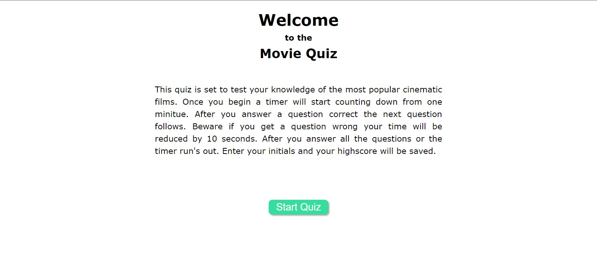

# Movie-Quiz

## Purpose

A timed eight question quiz about movies. That logs remaing time as your highscore once you've completed the questions or time ran out. Once finished you can enter your initials to log your highscore or press enter and it will log initials for you.

## Challenges

A few main challenges I ran into were hide the current and next questions as it prompted multiple bugs. I needed help from BCS, TA's and a Tutor. Though hours of MDN reading and stack workflow and many other sites I was able to debug the entire code. This was definitely the most challenging project for me so far. I think I can condense my code significatly, and plan to go back to do so once I learn how.

## Built With

* HTML
* CSS
* Javascript

## Website

<https://dsapione.github.io/Movie-Quiz/>
